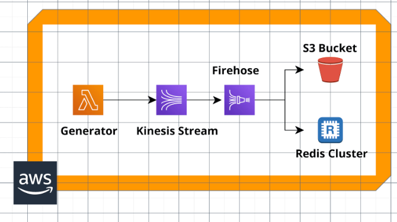
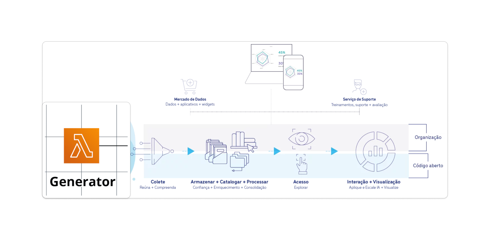

# Item 1 - Sobre Solutions Engineering para E-commerce

### Problema Principal a ser Resolvido
A arquitetura atual da empresa enfrenta desafios relacionados à escalabilidade e integração de grandes volumes de dados, além de dificuldades na aplicação de modelos de **inteligência artificial** para melhorar a experiência de compra dos clientes. Com um volume crescente de dados vindos de diferentes fontes (CRM, ERP, IoT, entre outros), é necessário uma solução que permita ingestão, processamento e análise eficiente, e que ao mesmo tempo possa suportar a adoção de **modelos de IA** avançados.

### Diagrama da Solução com Dadosfera
A solução proposta envolve a adoção da **Dadosfera** como a plataforma principal para ingestão, processamento e análise de dados. A arquitetura atual do cliente, que utiliza **AWS Lambda, Kinesis Streams e Redis** para o gerenciamento de dados em tempo real, pode ser parcialmente ou totalmente substituída pela infraestrutura da Dadosfera.

- **Arquitetura Atual (AWS)**:

  

A nova arquitetura proposta com a **Dadosfera** substituirá o pipeline de ingestão de dados e processamento em múltiplos sistemas, consolidando tudo em uma única plataforma. Isso permitirá a coleta e o armazenamento de dados no **S3 Bucket**, enquanto **Redis** pode ser substituído pela infraestrutura de processamento da Dadosfera, que permite a integração e a execução de consultas de alta performance.

- **Nova Arquitetura com Dadosfera**:

  

### Vantagens da Solução Dadosfera

#### 1. **Viabilidade Técnica**
A **Dadosfera** fornece uma solução integrada que facilita o processamento de grandes volumes de dados, tornando mais simples a adoção de **modelos de IA**. Ao substituir o pipeline distribuído da arquitetura AWS por uma única plataforma, o cliente pode obter um sistema mais robusto, com maior visibilidade e controle sobre os dados.

#### 2. **Custo-efetividade**
A solução da Dadosfera reduz a necessidade de múltiplos serviços de nuvem e diferentes ferramentas para ingestão e processamento, o que gera economias significativas em termos de infraestrutura e manutenção. Além disso, a plataforma unificada reduz a complexidade operacional, o que minimiza os custos de desenvolvimento e suporte.

#### 3. **Oportunidades e Ganhos Futuros**
A adoção da Dadosfera possibilitará ao cliente expandir o uso de modelos de IA e análises avançadas, uma vez que a plataforma oferece suporte nativo para **pipelines de inteligência artificial** e a criação de **Data Apps** para interações e visualizações de dados. Isso abrirá novas oportunidades para melhorar a experiência de compra dos clientes, como personalização de ofertas em tempo real e otimização de processos de vendas.

Além disso, a **Dadosfera** permite a criação de **dashboards interativos** e **consultas SQL** de alta performance, facilitando a extração de insights dos dados. Criar um dashboard na Dadosfera é fácil e intuitivo, permitindo uma visualização clara das categorias de produtos e preços. 

- **Criação de Dashboard**:

  

#### 4. **Data Apps e Integração de IA**
Além do processamento e consulta de dados, a plataforma permite a criação de **Data Apps**, onde os usuários podem explorar dados de produtos, calcular similaridades e gerar anúncios com **imagens criadas pela API DALL-E**, aplicando **inteligência artificial** para otimizar a visualização e a experiência do cliente.

- **Anúncio de Produto Gerado com IA**:

  

### Conclusão
A adoção da Dadosfera como plataforma central de dados para a empresa de e-commerce não só resolve os problemas de escalabilidade e processamento da arquitetura atual, como também abre novas oportunidades para o uso de inteligência artificial e otimização de processos. A solução é tecnicamente mais viável e oferece um custo mais baixo a longo prazo, proporcionando um ambiente de dados unificado e eficiente.