## Item 04 | Importação de Dados para a Dadosfera

Após a limpeza dos dados e a extração das features com o uso do LLM e Langchain, o próximo passo foi realizar a importação do dataset para a **Dadosfera**. Esse processo envolveu o carregamento do arquivo JSON contendo as features geradas e a organização dos dados dentro da plataforma.

### Passos Realizados

### 1. Processo de Importação do Dataset

Após preparar o arquivo `linhas_validas_com_features.json` com os dados e features extraídos, utilizei a interface da Dadosfera para carregar o arquivo. O dataset foi importado no formato JSON, como pode ser visto abaixo:

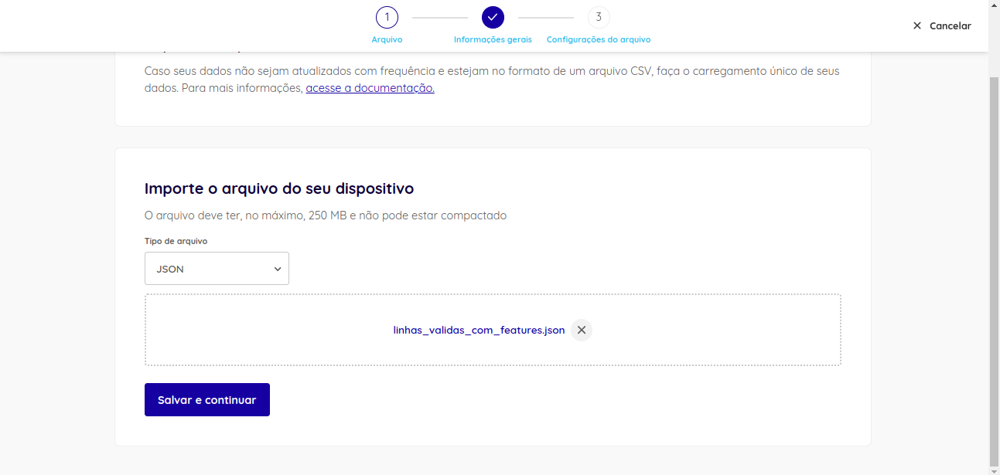

### 2. Confirmação do Sucesso na Importação

Após a importação, a plataforma indicou o sucesso da operação, permitindo que o arquivo fosse acessado no catálogo para futuras consultas e análises.

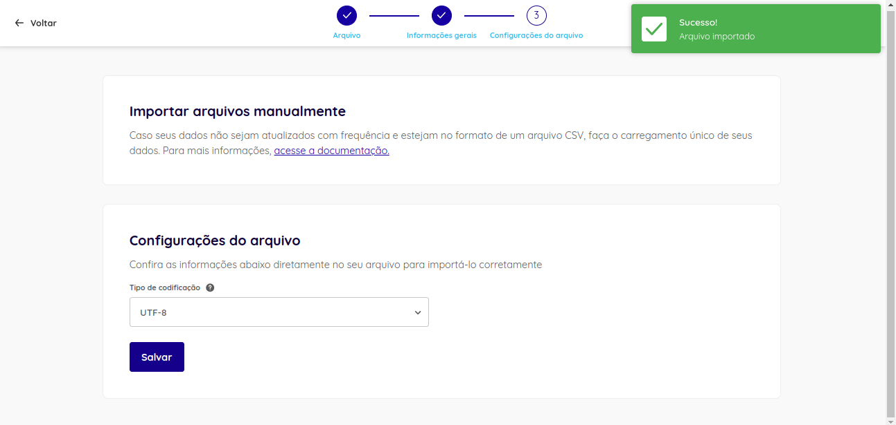

### 3. Visualização do Dataset Importado

O dataset importado foi acessado diretamente no catálogo da Dadosfera, onde foi possível visualizar as colunas `docid`, `title`, `text`, e `features`, com as features sendo armazenadas em formato JSON.

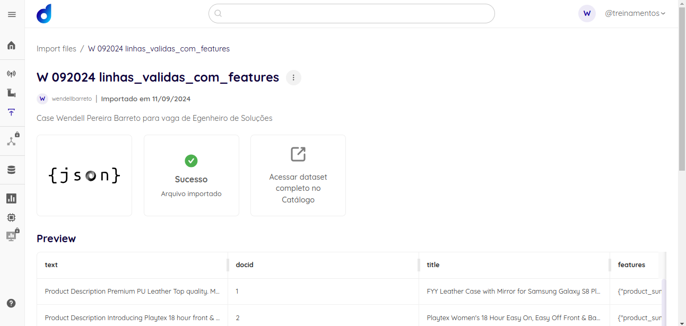

### 4. Detalhamento do Dataset no Catálogo

Ao acessar o dataset no catálogo, visualizei os dados processados e a estrutura de cada uma das colunas, bem como suas respectivas informações de documentação, conforme ilustrado abaixo.

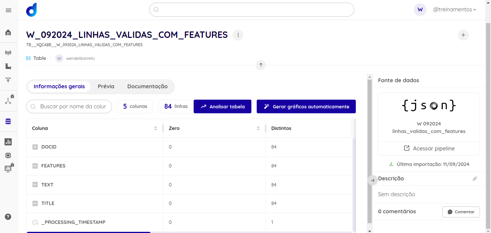

### 5. Análise das Colunas e Linhas

Por fim, realizei uma análise das colunas e linhas do dataset importado, verificando a estrutura do arquivo e confirmando que ele continha 84 linhas, cada uma representando um produto, com suas respectivas features e descrições.

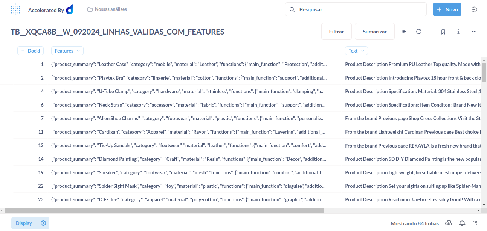

### 6. Criação de Coleções e Visualização de Dados

Após a importação dos dados, o próximo passo foi a criação de uma **coleção de perguntas** na plataforma da **Dadosfera**. O nome da coleção segue o formato solicitado, que inclui meu nome, sobrenome e o mês e ano da execução do projeto.

#### 6.1. Criação da Coleção
Na plataforma, criei uma coleção chamada `WENDELL_BARETO_DDF_SOLUTIONS_092024`, onde organizei as perguntas SQL que utilizarei para analisar as features extraídas dos produtos.

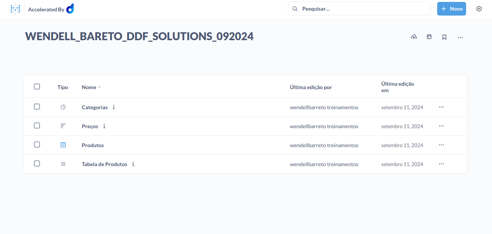

### 7. Criação de Perguntas SQL para Visualização

Dentro da coleção, criei várias perguntas focadas em diferentes aspectos das features dos produtos, como **Categorias**, **Preços**, **Produtos** e uma **Tabela de Produtos**. Essas perguntas permitirão uma visualização detalhada e filtrada das informações extraídas dos dados.

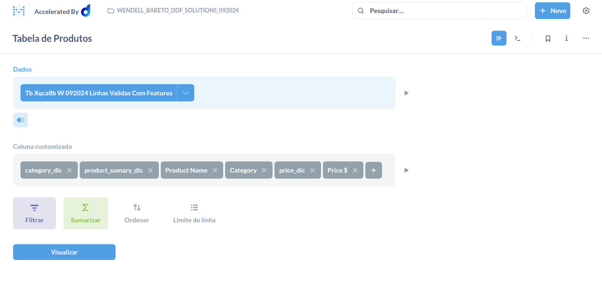

### 8. Extração e Tratamento das Features com Expressões Regulares

Para extrair as categorias e outras informações das features que estavam armazenadas em formato JSON dentro de uma coluna, utilizei **expressões regulares** para buscar e isolar as informações necessárias. Abaixo está um exemplo de uma expressão regular usada para extrair a categoria do produto.

```sql
= regexextract([Features], '"category":\s*"([^"]+)"')
```

Essa expressão identifica o campo `category` dentro da string JSON e retorna o valor correspondente, garantindo que cada produto seja corretamente categorizado.

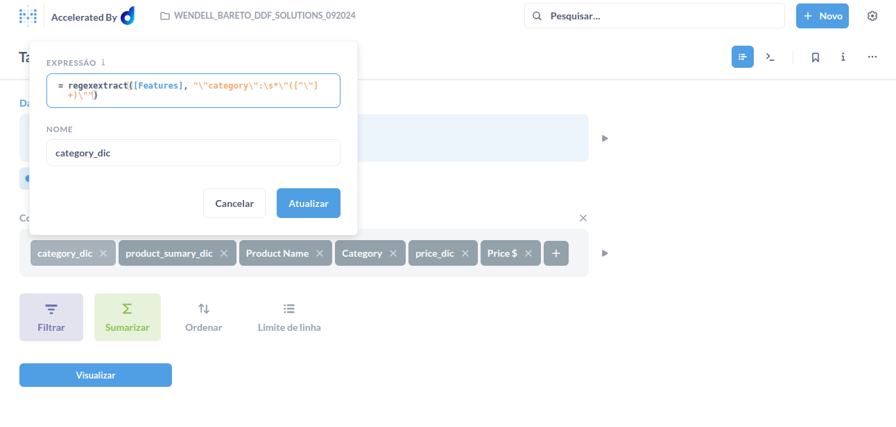

### 9. Consulta SQL Final para Visualização

Por fim, a consulta SQL completa, gerada automaticamente pela plataforma da Dadosfera, combina as informações extraídas das features, permitindo uma visualização clara das categorias, preços e descrições dos produtos.

```sql
SELECT
  "source"."DOCID" AS "DOCID",
  "source"."FEATURES" AS "FEATURES",
  "source"."TEXT" AS "TEXT",
  "source"."TITLE" AS "TITLE",
  "source"."_PROCESSING_TIMESTAMP" AS "_PROCESSING_TIMESTAMP",
  "source"."category_dic" AS "category_dic",
  "source"."product_sumary_dic" AS "product_sumary_dic",
  "source"."Product Name" AS "Product Name",
  "source"."Category" AS "Category",
  "source"."price_dic" AS "price_dic",
  "source"."Price $" AS "Price $"
FROM
  (
    SELECT
      "PUBLIC"."TB__XQCA8B__W_092024_LINHAS_VALIDAS_COM_FEATURES"."DOCID" AS "DOCID",
      "PUBLIC"."TB__XQCA8B__W_092024_LINHAS_VALIDAS_COM_FEATURES"."FEATURES" AS "FEATURES",
      "PUBLIC"."TB__XQCA8B__W_092024_LINHAS_VALIDAS_COM_FEATURES"."TEXT" AS "TEXT",
      "PUBLIC"."TB__XQCA8B__W_092024_LINHAS_VALIDAS_COM_FEATURES"."TITLE" AS "TITLE",
      "PUBLIC"."TB__XQCA8B__W_092024_LINHAS_VALIDAS_COM_FEATURES"."_PROCESSING_TIMESTAMP" AS "_PROCESSING_TIMESTAMP",
      REGEXP_SUBSTR(
        "PUBLIC"."TB__XQCA8B__W_092024_LINHAS_VALIDAS_COM_FEATURES"."FEATURES",
        '\"category\":\s*\"([^\"]+)\"'
      ) AS "category_dic",
      REGEXP_SUBSTR(
        "PUBLIC"."TB__XQCA8B__W_092024_LINHAS_VALIDAS_COM_FEATURES"."FEATURES",
        '\"product_summary\":\s*\"([^\"]+)\"'
      ) AS "product_sumary_dic",
      SUBSTRING(
        REGEXP_SUBSTR(
          "PUBLIC"."TB__XQCA8B__W_092024_LINHAS_VALIDAS_COM_FEATURES"."FEATURES",
          '\"product_summary\":\s*\"([^\"]+)\"'
        ),
        21,
        LENGTH(
          REGEXP_SUBSTR(
            "PUBLIC"."TB__XQCA8B__W_092024_LINHAS_VALIDAS_COM_FEATURES"."FEATURES",
            '\"product_summary\":\s*\"([^\"]+)\"'
          )
        ) - 21
      ) AS "Product Name",
      SUBSTRING(
        REGEXP_SUBSTR(
          "PUBLIC"."TB__XQCA8B__W_092024_LINHAS_VALIDAS_COM_FEATURES"."FEATURES",
          '\"category\":\s*\"([^\"]+)\"'
        ),
        14,
        LENGTH(
          REGEXP_SUBSTR(
            "PUBLIC"."TB__XQCA8B__W_092024_LINHAS_VALIDAS_COM_FEATURES"."FEATURES",
            '\"category\":\s*\"([^\"]+)\"'
          )
        ) - 14
      ) AS "Category",
      REGEXP_SUBSTR(
        "PUBLIC"."TB__XQCA8B__W_092024_LINHAS_VALIDAS_COM_FEATURES"."FEATURES",
        '"price":\s*([0-9]+)'
      ) AS "price_dic",
      SUBSTRING(
        REGEXP_SUBSTR(
          "PUBLIC"."TB__XQCA8B__W_092024_LINHAS_VALIDAS_COM_FEATURES"."FEATURES",
          '"price":\s*([0-9]+)'
        ),
        10,
        LENGTH(
          REGEXP_SUBSTR(
            "PUBLIC"."TB__XQCA8B__W_092024_LINHAS_VALIDAS_COM_FEATURES"."FEATURES",
            '"price":\s*([0-9]+)'
          )
        ) - 9
      ) AS "Price $"
    FROM
      "DADOSFERA_PRD_TREINAMENTOS"."PUBLIC"."TB__XQCA8B__W_092024_LINHAS_VALIDAS_COM_FEATURES"
  ) AS "source"
LIMIT
  1048575
```

Esse código SQL foi utilizado para gerar uma tabela que apresenta as principais features extraídas, como o nome do produto, categoria e preço, conforme mostrado na imagem abaixo.

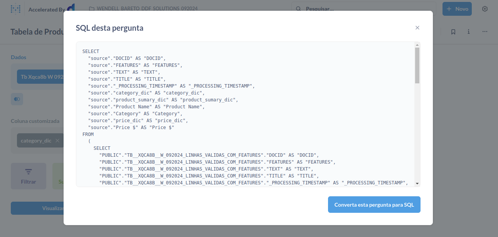

Esse código SQL foi utilizado para gerar uma tabela que apresenta as principais features extraídas, como o nome do produto, categoria e preço, conforme mostrado na imagem abaixo.


A consulta retornou uma tabela com as informações organizadas em colunas como `Product Name`, `Category`, `Price $`, e `Text`, que podem ser vistas na interface da plataforma Dadosfera.

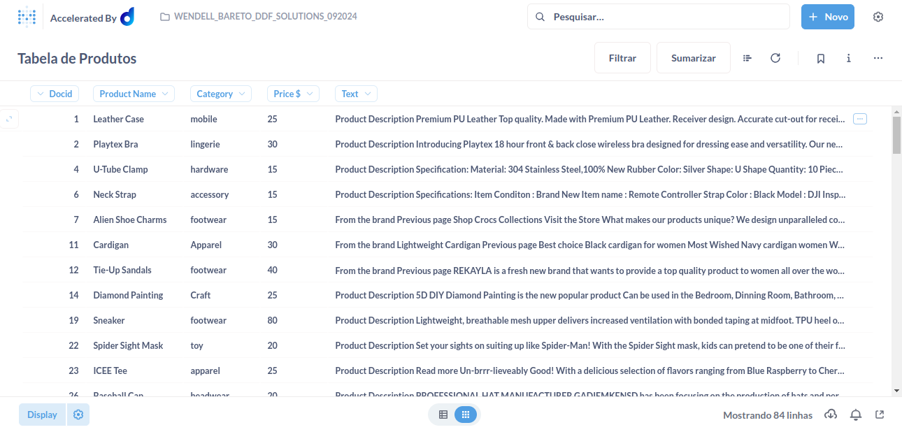

### 10. Criação do Dashboard para Visualização dos Dados

A partir da tabela de produtos gerada com as features extraídas, criei um **dashboard** para facilitar a análise visual dos dados. Esse dashboard foi estruturado com os seguintes elementos:

- **Gráfico de Pizza**: Mostra a distribuição das categorias dos produtos, com a porcentagem total de cada categoria representada por diferentes cores. É possível observar que a categoria dominante corresponde a "outdoor", representando 51,2% dos produtos.
- **Gráfico de Barras**: Representa a distribuição dos preços dos produtos, exibindo a contagem de produtos para diferentes faixas de preço.
- **Tabela de Produtos**: Apresenta uma visão detalhada dos produtos, incluindo o nome, categoria, preço, e uma breve descrição.

Esse dashboard permite uma análise rápida e eficiente dos dados categorizados e seus respectivos preços.

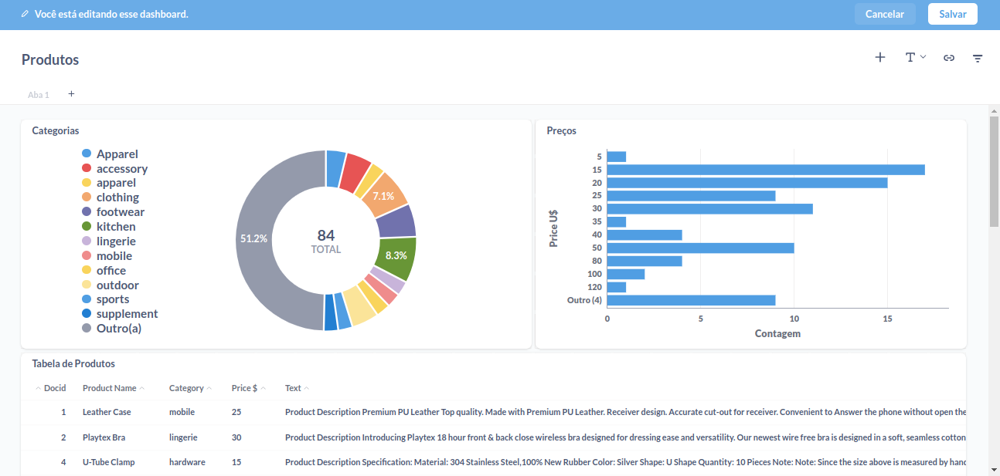