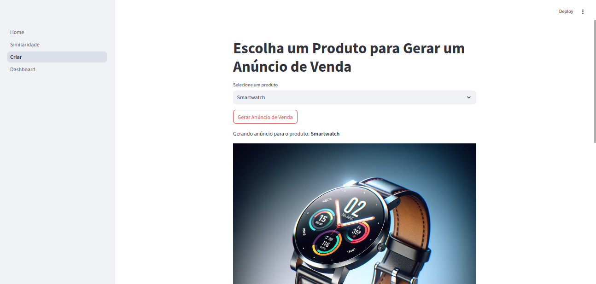

### Item 5 - Sobre Data Apps

Utilizei um **template de Data App fornecido pela Dadosfera** e implementei no ambiente JupyterLab da própria plataforma da Dadosfera. Abaixo você pode ver o ambiente de desenvolvimento onde realizei as modificações e criei o Data App utilizando o **Streamlit**:

- Imagem do **Build na Dadosfera**:
  

- Imagem do **JupyterLab na Dadosfera**:
  

Dentro do Data App, explorei os dados disponíveis, utilizando componentes dinâmicos para exibir informações sobre os produtos, calcular similaridades entre eles e gerar anúncios de vendas com imagens criadas através da API DALL-E. O layout do Data App foi organizado em diferentes páginas de fácil navegação, como pode ser visto na tela inicial:

Implementei as páginas que permitem explorar produtos semelhantes e criar anúncios de venda:

- Página de **Similaridade de Produtos**:
  

- Página de **Criação de Anúncios** com IA:
  

Adicionalmente, também importei o **Dashboard** utilizado no Item 4, inserindo-o na estrutura do Data App para permitir a visualização dos dados e métricas. A interface do Dashboard ficou conforme a imagem abaixo:

- Tela do **Dashboard**:
  

Com este Data App, o usuário pode facilmente explorar dados de produtos, encontrar os mais similares, criar anúncios com imagens geradas automaticamente e visualizar as métricas no painel de controle.

